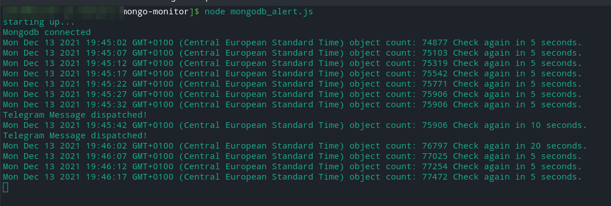

# mongo-monitor

Application for monitoring a mongoDB Database and Alert you via Telegram Bot when no new data entries are created within a specific time period. 

Ideal for monitoring live data capturing processes to make sure they do not crash or have any other problems. 

## Setup

Copy the `mongo-monitor.json_sample` to `mongodb_alert.json` and edit the file according to the configuration of your database.

Run `npm install` to install dependencies. 

To execute the program, run `tsc; node mongo-monitor`. 

I'd recommend running it with the **PM2 Process Manager** (https://pm2.keymetrics.io/). 

